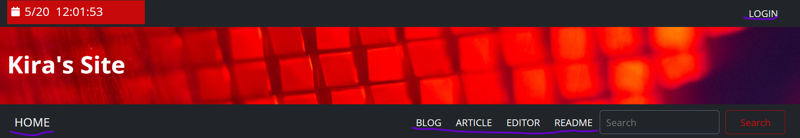

# Web前端开发作业提交

## 关于本作业

### 个人信息

```markdown
学号:2225060661
班级:22网2
```
### 项目信息

这个作业除了404已经完全去除了Bootstrap 5，全靠HTML+CSS+JS实现。原本是想做个类似Wordpress的简易、主题固定的CMS，但因为只是前端设计作业没有后端，所以就这样了。由于没有SQL,所以登录全靠Cookie实现，不同页面靠Session传递数据（虽然什么都没传送就是了）。原本想加SQL的，但是这毕竟是前端作业啊，万一不是被运行在服务器里打开的呢，加上还得带上数据库太麻烦了，不好交作业。

可点击按钮：



项目地址：https://kiramint.github.io/homework_demo/